<h3><code>chandragupta555@github ~ $ ./contributions.sh</code></h3>

  
<h3><code>chandragupta555@github ~ $ whoami</code></h3>
<table>
  <tr>
    <td valign="top"></td>
    <td valign="top"></td>
  </tr>
</table>

 

<h3><code>~ $ cat about.md</code></h3>

Competitive programmer and systems engineer building toward HFT/quant finance.
Focused on low-latency systems and quantitative infrastructure — currently
deep in market microstructure, order book mechanics, and portfolio analytics.
Solving problems the CP way: correctness first, then make it fast.

 

<h3><code>~ $ ls projects/</code></h3>

**[Leviathan-matching-engine](https://github.com/Chandragupta555/Leviathan-matching-engine)** `M8 · in development`
A limit order book and matching engine written in modern C++, implementing
price-time priority matching — the same core mechanism real exchanges run on.
Built to understand market microstructure from the ground up: order types,
matching logic, and the latency-sensitive data structures that make it fast.
Currently at milestone M8, actively iterating on correctness and performance.

 

**[portfolio-analytics-platform](https://github.com/Chandragupta555/portfolio-analytics-platform)** `v1`
A modular portfolio analytics engine in Python covering returns, risk metrics,
and reporting — built with a real software engineering workflow (tested,
structured, extensible) rather than a one-off script. The kind of tooling a
quant desk actually runs, not a notebook exercise. Currently at v1, with
more analytics modules planned.

 

<h3><code>~ $ cat contact.md</code></h3>

**LinkedIn:** [aaditya-g](https://www.linkedin.com/in/aaditya-g-29b995230/) · **Email:** [aadityasiddham555@gmail.com](mailto:aadityasiddham555@gmail.com) · **Codeforces:** [melechosher111](https://codeforces.com/profile/melechosher111) · **LeetCode:** [LuciferMorningstar777](https://leetcode.com/u/LuciferMorningstar777/)
